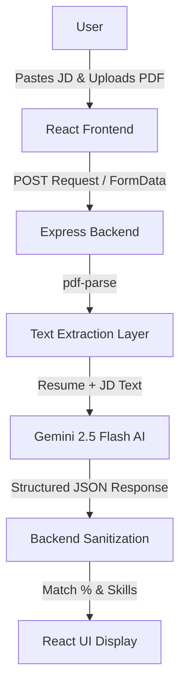

# AI Resume Analyzer & Match Engine

A full-stack application that analyzes the compatibility between a user's resume and a job description using the **Gemini 2.5 Flash API**.

## 🔗 Live Links
- **Frontend:** https://ai-resume-analyzer-seven-omega.vercel.app  
- **Backend:** Hosted on Render (Node.js)


## 🏗️ Project Structure
```text
AI-RESUME-ENGINE/
├── backend/
│   ├── server.js
│   ├── package.json
│   └── .env
│
├── frontend/
│   ├── src/
│   │   ├── App.jsx
│   │   └── index.css
│   └── .env
│
└── README.md
```

## 🔄 System Flow Chart

This diagram represents the end-to-end lifecycle of a single analysis request:

## 🛠️ Tech Stack
```
Frontend: React.js, Vite.
Backend: Node.js, Express.js.
AI: Google Gemini 2.5 Flash.
File Handling: Multer (Middleware) and PDF-Parse.
Deployment: Vercel (Frontend) and Render (Backend).
```

## 📖 How to Use
```
Paste the Job Description in the designated text area.

Upload your Resume (PDF).

Click Analyze Resume.

View your Match Percentage, Missing Skills, and Improvement Suggestions.
```

## 💻 Local Setup & Installation
```
If you want to run this project on your local machine, follow these steps:

1. Clone the Repository
Bash
git clone https://github.com/Ayan01456/AI-Resume-Analyzer-Job-Match-Engine
cd AI-Resume-Analyzer-Job-Match-Engine
2. Backend Setup
Bash
cd backend
npm install
Create a .env file in the backend folder.

Add your Gemini API Key: GEMINI_API_KEY=your_key_here.

Start the server: node server.js.

3. Frontend Setup
Bash
cd ../frontend
npm install
Create a .env file in the frontend folder.

Add the backend URL: VITE_API_URL=http://localhost:5000.

Start the app: npm run dev.
```

